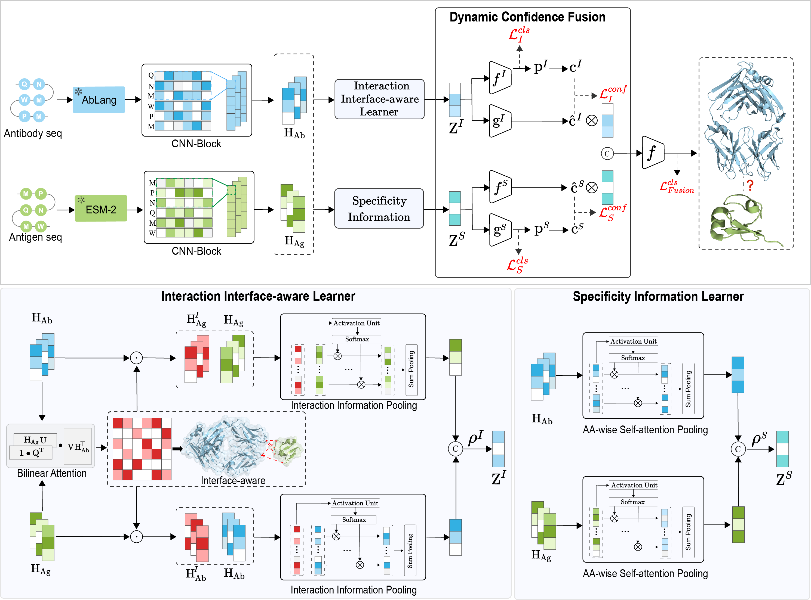

# DeepInterAware: Deep interaction interface-aware network for improving antigen-antibody Interaction Prediction from sequence data

## DeepInterAware

 In this paper, we propose **DeepInterAware** (deep interaction interface-aware network), a framework dynamically incorporating interaction interface information directly learned from sequence data, along with the inherent specificity information of the sequences. Relying solely on sequence data, it allows for a more profound insight into the underlying mechanisms of antigen-antibody interactions, offering the capability to identify potential binding sites and predict binding free energy changes due to mutations. 



## Table of contents

- [Dependencies](#Dependencies)
  - [From Conda](#From-Conda)
  - [From Docker](#From-Docker)

- [Data and Data process](#Data and Data process)
  - [Ag-Ab binding datasets](#Ag-Ab binding datasets)
  - [Ag-Ab neutralization datasets](#Ag-Ab neutralization datasets)
  - [Binding free energy change dataset](#Binding free energy change dataset)
  - [Data process](#Data process)
    - [Extraction of amino acid feature](#extraction-of-amino-acid-feature)

- [Model Train](#Model Train)
  - [Ag-Ag Binding Prediction](#Ag-Ag Binding Prediction)
  - [Ag-Ab Neutralization Prediction](#Ag-Ab Neutralization Prediction)

- [Model Test](#4. Moldel Test)
  - [Binding/Neutralization Prediction](#Binding/Neutralization Prediction)
  - [Identifies Potential Binding Sites](#Identifies Potential Binding Sites)
  - [ Calculates the binding affinity changes](#Calculates the binding affinity changes)
- [License](#License)
- [Conflict of Interest](#Conflict of Interest)
- [Cite Us](#cite-us)

## Dependencies

<font style="color:rgb(31, 35, 40);">Our model is tested in Linux with the following packages:</font>

+ <font style="color:rgb(31, 35, 40);">CUDA >= 11.3</font>
+ <font style="color:rgb(31, 35, 40);">PyTorch == 1.12.1 </font>
+ <font style="color:rgb(31, 35, 40);">anarchi == 1.3</font>
+ <font style="color:rgb(31, 35, 40);">ablang</font>
+ <font style="color:rgb(31, 35, 40);">antiberty</font>
+ transformers==4.24.0

### From Conda

We highly <font style="color:black;">recommend </font> that you use Anaconda for Installation:

```plain
conda create -n DeepInterAware
conda activate DeepInterAware
pip install -r requirements.txt
```

### From Docker

```shell
#run the docker
docker run --gpus all -idt deepinteraware --name run_images
```

## Data and Data process

### Ag-Ab binding datasets

[AVIDa-hIL6]() is a comprehensive Ag-Ab binding sequence dataset that includes the wild-type protein and 30 mutates of the human interleukin-6 (IL-6), alongside 38,599 VHH antibodies. To refine the dataset for our study, we employed ANARCI to extract the CDR loops from the antibody sequences and finally obtained 10,178 unique binding pairs and 315,708 non-binding pairs.

[SAbDab](https://opig.stats.ox.ac.uk/webapps/sabdab-sabpred/sabdab/) database  is a comprehensive compilation of all accessible Ag-Ab complexes, meticulously curated from the Protein Data Bank (PDB).   To adapt to the binding prediction task in our paper, we collected the complexes with antigen sequences containing more than 50 residues, and filtered out duplicates with the antibody CDR loops, arriving at a refined set of 1,513 unique complexes as the SAbDab dataset in our paper.

### Ag-Ab neutralization datasets

[HIV](https://www.hiv.lanl.gov/components/sequence/HIV/neutralization/) sequence database comprises neutralization antibodies related to the Human Immunodeficiency Virus (HIV). We meticulously filtered out Ag-Ab pairs that exhibited sequence homology levels exceeding 90% for both the antigen and the antibody components, and curated the HIV sequence dataset encompasses 24,907 neutralization pairs with sequences and 26,480 non-neutralization pairs.

[CoV-AbDab](https://opig.stats.ox.ac.uk/webapps/covabdab/) database offers detailed information regarding conventional antibodies and nanobodies capable of binding to various coronaviruses. We collected the Ag–Ab neutralization and non-neutralization pairs and antibody sequences from the CoV-AbDab database, and finally obtained the CoV-AbDab dataset consisting of 5,486 neutralization pairs and 9,110 non-neutralization pairs with sequences. 

### Binding free energy change dataset

[AB-Bind](https://github.com/sarahsirin/AB-Bind-Database) database  includes 1,101 mutants with experimentally determined changes in binding free energies (<font style="color:black;">△△</font>G) across 32 Ag-Ab complexes. In our study, we used all the data in the database as the dataset. 

[SKEMPI2](https://life.bsc.es/pid/skempi2/) database offers changes in protein-protein binding  energy, kinetics, and thermodynamics upon mutation. We screened Ag-Ab mutants, consisting of 1,021 unique mutants, as the SKEMPI2 dataset.

### Data process

All the processed data can be downloaded from [Link]([https://drive.google.com/file/d/12uMgZLxpqhP70tPNp-K4LFksN4E0re30/view](https://drive.google.com/file/d/12uMgZLxpqhP70tPNp-K4LFksN4E0re30/view) ) and stored in the data directory.

#### Extraction of amino acid feature

Download the ESM2 [pretrain  model](https://huggingface.co/facebook/esm2_t12_35M_UR50D) put into the /networks/pretrained-ESM2/ . To extract the amino acid feature, please run,

```python
python feature_encodr.py --data_path ./data/HIV --gpu 0
```

## Model Train

### Ag-Ag Binding Prediction

+ To evaluate the efficiency of DeepInterAware for binding prediction,  we conducted  the 5-fold cross-validation on the SAbDab dataset, please run:

```plain
python main.py --config=configs/SAbDAb.yml --dataset SAbDAb --kfold
```

+ To evaluate the efficiency of DeepInterAware for binding prediction, we conducted  the 5-fold cross-validation on the AVIDa-hIL6 dataset, please run:

```plain
python main.py --config=configs/AVIDa_hIL6.yml --dataset AVIDa_hIL6
```

+ For those baselines in our paper, we also evaluated their performance on these datasets (see Section 1.5 of the Supplementary Materials for implementation details), please run:

```plain
python baselines/baseline_main.py ----config=configs/baseline.yml --dataset SAbDab
```

+ The performances of our method and these baselines on the SAbDab dataset and  AVIDa-hIL6 dataset are demonstrated in Table 1 in the manuscript.

### Ag-Ab Neutralization Prediction

To evaluate the efficiency of DeepInterAware for neutralization prediction under the Ab Unseen, Ag Unseen, and Ag&Ab Unseen scenarios, we conducted  the 5-fold cross-validation on the HIV dataset, please run:

```
python main.py --cfg ./configs/HIV.yml --dataset HIV --unseen_task unseen
python main.py --cfg ./configs/HIV.yml --dataset HIV --unseen_task ab_unseen
python main.py --cfg ./configs/HIV.yml --dataset HIV --unseen_task ag_unseen
```

To evaluate the efficiency of DeepInterAware for transferability, we conducted  the 5-fold cross-validation on the CoV-AbDab dataset, please run:

```
python transfer.py  --config=configs/HIV.yml --unseen_task transfer
```

## Model Test

### Binding/Neutralization Prediction

```
python usage.py --task SAbDab --test_file ./data/SAbDab/test_ag_ab.csv --gpu 0 --model_path ./save_models/

python usage.py --task HIV --test_file ./data/HIV/test_ag_ab.csv --gpu 0 --model_path ./save_models/
```

### Identifies Potential Binding Sites

+ In addition to  its primary benefits in Ag-Ab interaction prediction, our model can learn some structural information for the sequences and lead to superior performances, and we try to validate this point by testing the capability of our method in identifying potential binding sites:

```plain
python usage.py --task binding_site --pdb_file ./data/SAbDab/pdb/ --pdb 6i9i_H_L_C --gpu 0 --model_path ./save_models/
```

### Calculates the binding affinity changes


+ The residue mutations of antigen and antibody sequences can significantly alter the AAI. To thoroughly evaluate the performance of DeepInterAware in identifying the efficacy of Ag-Ab mutants, we adopt Ag-Ab complexes and mutants as well as experimentally determined changes in binding free energies:

```plain
python usage.py --task ddG --wt ./data/example/wt.csv --mu ./data/example/mu.csv --gpu 0 --model_path ./save_models/
```

## License

<font style="color:rgb(51, 51, 51);">DeepInterAware content and derivates are licensed under </font>[CC BY-NC 4.0](https://creativecommons.org/licenses/by-nc/4.0/)<font style="color:rgb(51, 51, 51);">. If you have any requirements beyond the agreement, you can contact us.</font>

## Conflict of Interest

W.Z., and Y.X. are inventors on patent applications related to this work filed by Wuhan Huamei Biotech Co.,Ltd. (Chinese  patent application nos. 2023.12.21 202311783760.X). The authors declare no other competing interests.

## Cite Us

Feel free to cite this work if you find it useful to you!

```sh
@article{DeepInterAware,
    title={DeepInterAware: deep interaction interface-aware network for improving antigen-antibody interaction prediction from sequence data},
    author={Yuhang Xia, Zhiwei Wang,Feng Huang,Zhankun Xiong,Yongkang Wang, Minyao Qiu, Wen Zhang},
    year={2024},
}
```


