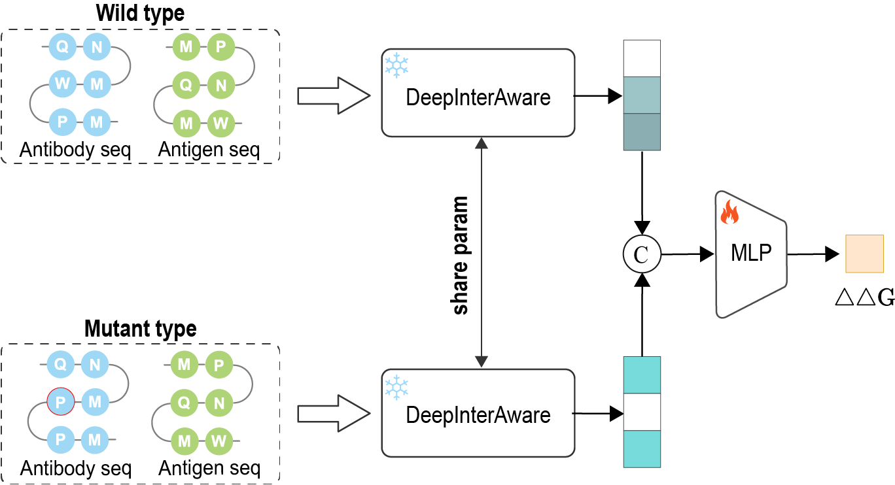

# DeepInterAware: Deep interaction interface-aware network for improving antigen-antibody Interaction Prediction from sequence data


## DeepInterAware

 In this paper, we propose **DeepInterAware** (deep interaction interface-aware network), a framework dynamically incorporating interaction interface information directly learned from sequence data, along with the inherent specificity information of the sequences. Relying solely on sequence data, it allows for a more profound insight into the underlying mechanisms of antigen-antibody interactions, offering the capability to identify potential binding sites and predict binding free energy changes due to mutations. 


## Table of contents

- [Installation](#1.Installation)
- [Data and Data process](#2.Data and Data proceess)
  - [Extract the CDR loops](#2.1 extract-the-CDR-loops)
  - [Calculate binding sites and binding pairs](#2.2 calculate-binding-sites-and-binding-pairs)
  - [Extraction of amino acid feature](#2.3 extraction-of-amino-acid-feature)
- [Model training ](#3. model-training and test)
- [Usage](#4. Usage)
  - [Predict antigen-antibody binding or neutralization](#4.1 predict-antigen-antibody-binding-or-neutralization)
  - [Indentify binding sites](#4.2 Indentify-Binding-sites)
  - [Calculate the weights of the CDR regions](#4.3 Calculate-the-weights-of-the-CDR-regions)
  - [Binding affinity changes](#4.4 Binding-affinity-changes)
- [License](#5. License)
- [Cite Us](#6. cite-us)

## 1. Dependencies

We highly recommand that you use Anaconda for Installation

```shell
conda create -n DeepInterAware
conda activate DeepInterAware
pip install -r requirements.txt
```

## 2. Data and Data proceess

The AVIDa-hIL6 data are available at [link](https://cognanous.com/datasets/avida-hil6). The SAbDab data are available at [link](https://opig.stats.ox.ac.uk/webapps/sabdab-sabpred/sabdab). The HIV data are available from CATNAP at [link](https://www.hiv.lanl.gov/components/sequence/HIV/neutralization/download_db.comp). The SARS-CoV-2 data are available from CoVAbDab at [link](http://opig.stats.ox.ac.uk/webapps/covabdab/). 

The Antigen-Antibody data is in the `data` folder, the process data can be downloaded in this [link](https://drive.google.com/file/d/12uMgZLxpqhP70tPNp-K4LFksN4E0re30/view?usp=sharing).

* `data/AVIDa_hIL6/ab_ag_pair.csv` is the paired Ab-Ag data of AVIDa_hIL6 dataset.
* `data/SAbDab/ab_ag_pair.csv` is the paired Ab-Ag data of SAbDab dataset.
* `data/HIV/ab_ag_pair.csv` is the all paired Ab-Ag data of HIV dataset.
* `data/CoVAbDab/ab_ag_pair.csv` is the all paired Ab-Ag data of CoVAbDab  dataset.

### 2.1 Extract the CDR loops

To extract the CDR loops ,please run,

```python
python cdr_extract.py --data_path ./data/SAbDab/
```

### 2.2 Calculate binding sites and binding pairs

To calculate the binding sites and binding pairs,please run

```python
from binding_site import get_binding_site
full_seq,full_label,seq_dict,ab_info,label_dict = get_binding_site('3vrl','H','L','C') #PDB ID,heavy,light,antigen
```

```python
>>full_dict #Full length sequences and site label
{'res_H': 'DVKLVESGGGLVKPGGSLKLSCAASGFTFSSYTMSWVRQTPEKRLEWVAIISSGGSYTYYSDSVKGRFTISRDNAKNTLYLQMSSLKSEDTAMYYCTRDEGNGNYVEAMDYWGQGTSVTVSSAKTTPPSVYPLAPGSAAQTNSMVTLGCLVKGYFPEPVTVTWNSGSLSSGVHTFPAVLQSDLYTLSSSVTVPSSTWPSETVTCNVAHPASSTKVDKKIVPR', 'res_L': 'DIQMTQSPASLSASVGETVTITCRASGNIHNYLAWYQQKQGKSPQLLVYNAKTLADGVPSRFSGSGSGTQYSLKINSLQPEDFGSYYCQHFWSTPRTFGGGTKLEIKRADAAPTVSIFPPSSEQLTSGGASVVCFLNNFYPKDINVKWKIDGSERQNGVLNSWTDQDSKDSTYSMSSTLTLTKDEYERHNSYTCEATHKTSTSPIVKSFNRNEC', 'res_AG': 'SILDIKQGPKESFRDYVDRFFKTLRAEQCTQDVKNWMTDTLLVQNANPDCKTILRALGPGATLEEMMTACQGV'}
```

```python
>>full_label
{'label_H': [0, 0, 0, 0, 0, 0, 0, 0, 0, 0, 0, 0, 0, 0, 0, 0, 0, 0, 0, 0, 0, 0, 0, 0, 0, 0, 0, 0, 0, 0, 0, 1, 1, 0, 0, 0, 0, 0, 0, 0, 0, 0, 0, 0, 0, 0, 0, 0, 0, 1, 1, 1, 1, 1, 1, 1, 1, 1, 1, 0, 0, 0, 0, 0, 0, 0, 0, 0, 0, 0, 0, 0, 0, 0, 0, 0, 0, 0, 0, 0, 0, 0, 0, 0, 0, 0, 0, 0, 0, 0, 0, 0, 0, 0, 0, 0, 0, 0, 1, 1, 1, 1, 1, 1, 1, 1, 1, 0, 0, 0, 0, 0, 0, 0, 0, 0, 0, 0, 0, 0, 0, 0, 0, 0, 0, 0, 0, 0, 0, 0, 0, 0, 0, 0, 0, 0, 0, 0, 0, 0, 0, 0, 0, 0, 0, 0, 0, 0, 0, 0, 0, 0, 0, 0, 0, 0, 0, 0, 0, 0, 0, 0, 0, 0, 0, 0, 0, 0, 0, 0, 0, 0, 0, 0, 0, 0, 0, 0, 0, 0, 0, 0, 0, 0, 0, 0, 0, 0, 0, 0, 0, 0, 0, 0, 0, 0, 0, 0, 0, 0, 0, 0, 0, 0, 0, 0, 0, 0, 0, 0, 0, 0, 0, 0, 0, 0, 0, 0, 0, 0, 0, 0], 'label_L': [0, 0, 0, 0, 0, 0, 0, 0, 0, 0, 0, 0, 0, 0, 0, 0, 0, 0, 0, 0, 0, 0, 0, 0, 0, 0, 0, 0, 0, 0, 0, 1, 0, 0, 0, 0, 0, 0, 0, 0, 0, 0, 0, 0, 0, 0, 0, 0, 0, 0, 0, 0, 0, 0, 0, 0, 0, 0, 0, 0, 0, 0, 0, 0, 0, 0, 0, 0, 0, 0, 0, 0, 0, 0, 0, 0, 0, 0, 0, 0, 0, 0, 0, 0, 0, 0, 0, 0, 0, 0, 1, 1, 1, 1, 0, 1, 0, 0, 0, 0, 0, 0, 0, 0, 0, 0, 0, 0, 0, 0, 0, 0, 0, 0, 0, 0, 0, 0, 0, 0, 0, 0, 0, 0, 0, 0, 0, 0, 0, 0, 0, 0, 0, 0, 0, 0, 0, 0, 0, 0, 0, 0, 0, 0, 0, 0, 0, 0, 0, 0, 0, 0, 0, 0, 0, 0, 0, 0, 0, 0, 0, 0, 0, 0, 0, 0, 0, 0, 0, 0, 0, 0, 0, 0, 0, 0, 0, 0, 0, 0, 0, 0, 0, 0, 0, 0, 0, 0, 0, 0, 0, 0, 0, 0, 0, 0, 0, 0, 0, 0, 0, 0, 0, 0, 0, 0, 0, 0, 0, 0, 0, 0, 0, 0], 'label_AG': [0, 0, 0, 0, 0, 0, 0, 0, 1, 0, 1, 0, 0, 0, 0, 0, 0, 0, 0, 0, 0, 0, 0, 0, 0, 0, 0, 0, 0, 0, 0, 0, 0, 0, 0, 0, 0, 0, 0, 0, 0, 0, 0, 0, 0, 0, 1, 0, 1, 1, 0, 1, 1, 1, 1, 1, 1, 1, 1, 1, 1, 0, 0, 0, 1, 0, 0, 1, 1, 1, 1, 1, 1], 'label_AGH': [[8, 10, 46, 48, 48, 48, 48, 48, 48, 49, 51, 51, 51, 52, 52, 52, 52, 53, 54, 54, 54, 54, 54, 54, 54, 55, 55, 56, 57, 58, 64, 67, 68, 69, 70, 71, 72], [56, 56, 56, 56, 51, 53, 55, 52, 54, 56, 32, 31, 50, 32, 49, 57, 58, 104, 103, 105, 102, 99, 100, 101, 106, 105, 98, 58, 104, 104, 58, 58, 58, 56, 56, 56, 55]], 'label_AGL': [[55, 56, 56, 56, 57, 57, 58, 58, 59, 60, 64], [95, 93, 91, 92, 91, 90, 90, 31, 91, 91, 93]]}
```

```python
>>ab_info #antibody information
Munch({'H_cdr1_range': [27, 37], 'H_cdr1': 'TFSSYTMSWV', 'H_cdr2_range': [44, 61], 'H_cdr2': 'LEWVAIISSGGSYTYYS', 'H_cdr3_range': [94, 112], 'H_cdr3': 'YCTRDEGNGNYVEAMDYW', 'H_cdr': 'TFSSYTMSWVLEWVAIISSGGSYTYYSYCTRDEGNGNYVEAMDYW', 'L_cdr1_range': [27, 38], 'L_cdr1': 'NIHNYLAWYQQ', 'L_cdr2_range': [43, 57], 'L_cdr2': 'PQLLVYNAKTLADG', 'L_cdr3_range': [86, 98], 'L_cdr3': 'YCQHFWSTPRTF', 'L_cdr': 'NIHNYLAWYQQPQLLVYNAKTLADGYCQHFWSTPRTF'})
```

```python
>>seq_dict
{'H_cdr': 'TFSSYTMSWVLEWVAIISSGGSYTYYSYCTRDEGNGNYVEAMDYW', 'ag_seq': 'SILDIKQGPKESFRDYVDRFFKTLRAEQCTQDVKNWMTDTLLVQNANPDCKTILRALGPGATLEEMMTACQGV', 'ab_cdr': 'TFSSYTMSWVLEWVAIISSGGSYTYYSYCTRDEGNGNYVEAMDYWNIHNYLAWYQQPQLLVYNAKTLADGYCQHFWSTPRTF', 'L_cdr': 'NIHNYLAWYQQPQLLVYNAKTLADGYCQHFWSTPRTF'}
```

```python
>>label_dict #The label after the CDR region is extracted
{'epitope': [0, 0, 0, 0, 0, 0, 0, 0, 1, 0, 1, 0, 0, 0, 0, 0, 0, 0, 0, 0, 0, 0, 0, 0, 0, 0, 0, 0, 0, 0, 0, 0, 0, 0, 0, 0, 0, 0, 0, 0, 0, 0, 0, 0, 0, 0, 1, 0, 1, 1, 0, 1, 1, 1, 1, 1, 1, 1, 1, 1, 1, 0, 0, 0, 1, 0, 0, 1, 1, 1, 1, 1, 1], 'paratope': [0, 0, 0, 0, 1, 1, 0, 0, 0, 0, 0, 0, 0, 0, 0, 1, 1, 1, 1, 1, 1, 1, 1, 1, 1, 0, 0, 0, 0, 0, 0, 1, 1, 1, 1, 1, 1, 1, 1, 1, 0, 0, 0, 0, 0, 0, 0, 0, 0, 1, 0, 0, 0, 0, 0, 0, 0, 0, 0, 0, 0, 0, 0, 0, 0, 0, 0, 0, 0, 0, 0, 0, 0, 0, 1, 1, 1, 1, 0, 1, 0, 0], 'paratope-epitope': [(4, 51), (5, 51), (5, 52), (15, 52), (16, 51), (17, 48), (18, 48), (19, 48), (20, 48), (21, 48), (21, 72), (22, 8), (22, 10), (22, 46), (22, 48), (22, 49), (22, 69), (22, 70), (22, 71), (23, 52), (24, 52), (24, 56), (24, 64), (24, 67), (24, 68), (31, 55), (32, 54), (33, 54), (34, 54), (35, 54), (36, 54), (37, 53), (37, 57), (37, 58), (38, 54), (38, 55), (39, 54), (49, 58), (74, 57), (74, 58), (75, 56), (75, 57), (75, 59), (75, 60), (76, 56), (77, 56), (77, 64), (79, 55)]}
```

### 2.3 Extraction of amino acid feature

Download the ESM2 [pretrain  model](https://huggingface.co/facebook/esm2_t12_35M_UR50D) put into the /networks/pretrained-ESM2/ . To extract the amino acid feature, please run,

```python
python feature_encodr.py --data_path ./data/SAbDab
```


## 3. Model training and test

To train DeepInterAware on antigen-antibody tasks, please run

```python
python main.py --cfg ./configs/SAbDab.yml --dataset SAbDab --kfold --gpu 1 --data_path ./data/
python main.py --cfg ./configs/HIV.yml --dataset HIV --unseen_task unseen
python main.py --cfg ./configs/AVIDa_hIL6.yml --dataset AVIDa_hIL6 --unseen_task ag_unseen
python transfer.py  --config=configs/HIV.yml --unseen_task transfer
```

```
python affinity_maturation.py --gpu 0 --data_path /root/autodl-tmp/data/ --model_name ESM2AbLang --ab_name ablang --mode train --seed 0 --lr 1e-3
python affinity_maturation.py --gpu 0 --data_path /root/autodl-tmp/data/ --model_name ESM2Antiberty --ab_name antiberty --mode train --seed 0 --lr 1e-3

python affinity_maturation.py --gpu 0 --data_path /root/autodl-tmp/data/ --model_name DeepInterAware --ab_name ablang --mode train --seed 1 --lr 5e-4 --result_path /root/deepinteraware/result/mutant_result/DeepInterAware
```


## 4. Usage

Download the checkpoint of DeepInterAware and modify the paths in the code.

| Content                  | Link                                                         |
| ------------------------ | ------------------------------------------------------------ |
| Checkpoint on SAbDab     | [link](https://figshare.com/ndownloader/files/44970310)      |
| Checkpoint on AVIDa-hIL6 | [link](https://figshare.com/ndownloader/files/44970310)      |
| Checkpoint on HIV Unseen | [link](https://figshare.com/ndownloader/files/45053224)      |
| Checkpoint on CoVAbDab   | [link](https://drive.google.com/file/d/1_KhHEfA62XjOO5AaujJM82R68oZy3rWD/view?usp=drive_link) |
| Checkpoint on AB-Bind    |                                                              |
| Checkpoint on SKEMPI     |                                                              |


### 4.1 Predict antigen-antibody binding or neutralization

For example, to test DeepInterAware on SAbDab test data, please run

```python
from models import DeepInterAware,load_model
form feature_encoder import getAAfeature

ag_list = [
        'DSFVCFEHKGFDISQCPKIGGHGSKKCTGDAAFCSAYECTAQYANAYCSHA',
        'SILDIKQGPKESFRDYVDRFFKTLRAEQCTQDVKNWMTDTLLVQNANPDCKTILRALGPGATLEEMMTACQGV'
] #The antigen sequence length is less than 800
ab_list = [
    ('DPNSDHMSWVLEWIAIIYASGTTYYAFCATYPNYPTDNLW','SVYNYLLSWYQQPKRLIYSASTLASGYCLGSYDGNSADCLAF'),
    ('TFSSYTMSWVLEWVAIISSGGSYTYYSYCTRDEGNGNYVEAMDYW','NIHNYLAWYQQPQLLVYNAKTLADGYCQHFWSTPRTF')
]#The CDR sequence length is less than 110
ag_token_ft,ab_token_ft = getAAfeature(ag_list, ab_list, gpu=0)
ag_mask,ab_mask = get_mask(ag_list, ab_list,gpu=0)
model= load_model(f'./configs/SAbDab.yml',model_path=f'./save_models/SAbDab.pth',gpu=0)
model.eval()
with torch.no_grad():
    output = model.inference(ag_token_ft,ab_token_ft,ag_mask,ab_mask)
print(output.score)
```

The output is:

```python
tensor([0.9996, 1.0000])
```

### 4.2 Indentify binding sites

```python
from utils.binding_site import draw_site_map, get_binding_site
from utils.feature_encoder import get_mask,getAAfeature
from models import load_model
import torch

full_seq, full_label, seq_dict, ab_info, label_dict = get_binding_site('6i9i','H','L','C')
ag_list = [seq_dict['ag_seq']]
ab_list = [(seq_dict['H_cdr'],seq_dict['L_cdr'])]
ag_token_ft,ab_token_ft = getAAfeature(ag_list, ab_list, gpu=1)
ag_mask,ab_mask,ag_len,ab_len = get_mask(ag_list, ab_list,gpu=1)

model= load_model('DeepInterAware',f'./configs/SAbDab.yml',model_path=f'./save_models/SAbDab.pth',gpu=1)
model.eval()
with torch.no_grad():
    output = model.inference(ag_token_ft,ab_token_ft,ag_mask,ab_mask)
ag_recall,ab_recall,pair_recall = draw_site_map('6i9i',output,ag_len,ab_len,label_dict,threshold=0.5)
```

Antigen attention map


Antibody attention map


### 4.3 Calculate the weights of the CDR regions

The following code is executed to calculate the weights of the CDR regions.

```python
from utils.binding_site import attribution_cdr
weight_list = attribution_cdr(output, ab_info, ab_len)
>>weight_list #[HCDR1,HCDR2,HCDR3,LCDR1,LCDR2,LCDR3]
[[0.12554966, 0.21922821, 0.31082207, 0.11571003, 0.11434505, 0.11434505] ]
```

### 4.4 Binding affinity changes



For batch prediction of binding affinity changes, execute the following command

```python
python affinity_maturation.py --mode test --wt ./data/example/wt.csv --mu ./data/example/mu.csv --gpu 0
```

## Docker

```
docker push xyh5683/deepinteraware:tagname
```


## 5. License

DeepInterAware content and derivates are licensed under [CC BY-NC 4.0](https://creativecommons.org/licenses/by-nc/4.0/).  If you have any requirements beyond the agreement, you can contact us.

## 6. Cite Us

Feel free to cite this work if you find it useful to you!

```sh
@article{DeepInterAware,
    title={DeepInterAware: deep interaction interface-aware network for improving antigen-antibody interaction prediction from sequence data},
    author={Yuhang Xia, Zhiwei Wang,Feng Huang,Zhankun Xiong,Yongkang Wang, Minyao Qiu, Wen Zhang},
    year={2024},
}
```

